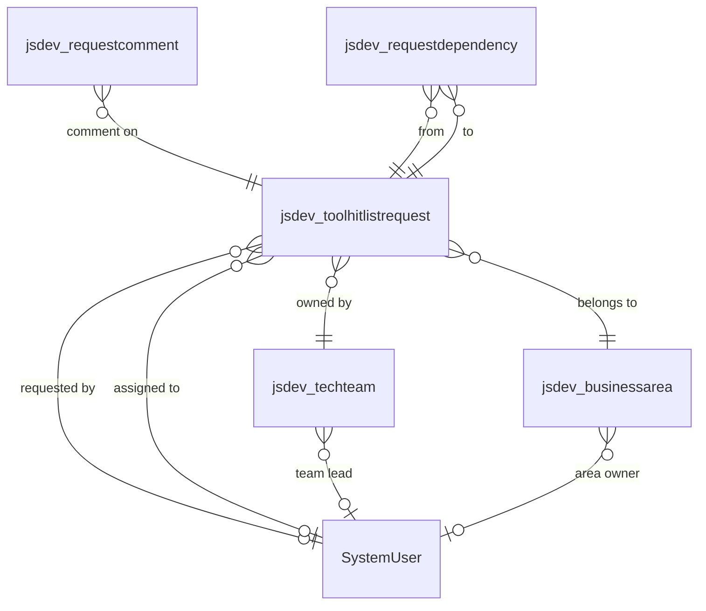

# Dataverse Schema – ToolHitList

**Solution:** `TaskList` | **Publisher prefix:** `jsdev_` | **Environment:** Dev (`https://orgfe8637fb.crm11.dynamics.com`)

> This document is the authoritative reference for all Dataverse tables, columns, relationships, and choice values for the ToolHitList application. Review and approve before any table creation begins.

---

## Entity Relationship Overview



**Creation order** (respect foreign key dependencies):
1. `jsdev_businessarea`
2. `jsdev_techteam`
3. `jsdev_toolhitlistrequest`
4. `jsdev_requestcomment`
5. `jsdev_requestdependency`

---

## Table 1 — `jsdev_businessarea` (Business Area)

**Purpose:** Admin-managed lookup list of business areas. Drives the typeahead dropdown on the request form. No app deploy needed to add/remove areas.

**Display Name:** Business Area  
**Plural Display Name:** Business Areas  
**Primary Name Column:** `jsdev_name`  
**Ownership:** Organisation-owned

| Logical Name | Display Name | Type | Required | Notes |
|---|---|---|---|---|
| `jsdev_businessareaid` | Business Area | Primary Key (GUID) | Auto | System-managed |
| `jsdev_name` | Name | Single Line Text (100) | ✅ Yes | Used as primary name; shown in all dropdowns |
| `jsdev_ownerid` | Area Owner | Lookup → SystemUser | No | Optional — the business owner/sponsor of this area |
| `createdon` | Created On | DateTime | Auto | System-managed |
| `modifiedon` | Modified On | DateTime | Auto | System-managed |

**Sample data to seed:**
- Finance
- Operations
- Commercial
- HR
- Technology
- Legal & Compliance

---

## Table 2 — `jsdev_techteam` (Tech Team)

**Purpose:** Admin-managed lookup list of technology delivery teams. Used for Kanban filtering and request assignment.

**Display Name:** Tech Team  
**Plural Display Name:** Tech Teams  
**Primary Name Column:** `jsdev_name`  
**Ownership:** Organisation-owned

| Logical Name | Display Name | Type | Required | Notes |
|---|---|---|---|---|
| `jsdev_techteamid` | Tech Team | Primary Key (GUID) | Auto | System-managed |
| `jsdev_name` | Team Name | Single Line Text (100) | ✅ Yes | Used as primary name; shown in Kanban filters |
| `jsdev_teamleadid` | Team Lead | Lookup → SystemUser | No | Optional |
| `createdon` | Created On | DateTime | Auto | System-managed |
| `modifiedon` | Modified On | DateTime | Auto | System-managed |

**Sample data to seed:**
- Platform & Automation
- Data & Analytics
- Integration & APIs

---

## Table 3 — `jsdev_toolhitlistrequest` (Tool Hit List Request)

**Purpose:** The core entity. Each row is one technology request raised by the business, progressing through the workflow lifecycle.

**Display Name:** Tool Hit List Request  
**Plural Display Name:** Tool Hit List Requests  
**Primary Name Column:** `jsdev_title`  
**Ownership:** User-owned (the business requester)

### 3a. Business Requester Fields

| Logical Name | Display Name | Type | Required | Max Length / Precision | Notes |
|---|---|---|---|---|---|
| `jsdev_toolhitlistrequestid` | Request | Primary Key (GUID) | Auto | — | System-managed |
| `jsdev_title` | Title | Single Line Text | ✅ Yes | 200 | Short name shown on Kanban cards |
| `jsdev_description` | Request Description | Multiple Lines of Text | ✅ Yes | 4000 | Full "what and why" description |
| `jsdev_requestedbyid` | Requested By | Lookup → SystemUser | No | — | Who originated the need; may differ from creator |
| `jsdev_businessareaid` | Business Area | Lookup → `jsdev_businessarea` | ✅ Yes | — | Drives typeahead dropdown |
| `jsdev_priority` | Priority | Choice | ✅ Yes | — | See Choice: Priority |
| `jsdev_timecurrentlyspent` | Time Currently Spent (hrs/wk) | Decimal Number | No | Precision 2 | Hours per week the business currently spends on this problem |

### 3b. Tech Lead Fields

| Logical Name | Display Name | Type | Required | Notes |
|---|---|---|---|---|
| `jsdev_techteamid` | Tech Team | Lookup → `jsdev_techteam` | No | Set when Tech Lead assigns to a team |
| `jsdev_assigneeid` | Assignee | Lookup → SystemUser | No | **Required before promotion to Top 10 Backlog** |
| `jsdev_stage` | Stage | Choice | ✅ Yes | See Choice: Stage. Default = Draft (1) |
| `jsdev_queueposition` | Queue Position | Whole Number | No | 1–10; only populated in Top 10 Backlog stage; null otherwise |
| `jsdev_duedate` | Due Date | Date Only | No | Target delivery date |

### 3c. Tech Specialist Fields

| Logical Name | Display Name | Type | Required | Notes |
|---|---|---|---|---|
| `jsdev_tshirtsize` | T-Shirt Size | Choice | No | **Required before promotion to Top 10 Backlog**. See Choice: T-Shirt Size |
| `jsdev_technologytouched` | Technology Touched | Multi-Select Option Set | No | See Choice: Technology Touched |
| `jsdev_technicalapproach` | Technical Approach | Multiple Lines of Text | No | Max 4000. Visible to business users read-only |
| `jsdev_collaborationrequired` | Collaboration Required | Two Options (Yes/No) | No | Default: No |
| `jsdev_collaborationdepartments` | Collaboration Departments | Multiple Lines of Text | No | Max 2000. Enabled when `jsdev_collaborationrequired` = Yes |
| `jsdev_dependencynotes` | Dependency Notes | Multiple Lines of Text | No | Max 2000. Free-text supplement to linked dependency records |
| `jsdev_timesavedestimate` | Time Saved Estimate (hrs/wk) | Decimal Number | No | Precision 2 |

### 3d. Post-Production Fields (Business User, after go-live)

| Logical Name | Display Name | Type | Required | Notes |
|---|---|---|---|---|
| `jsdev_actualtimesaved` | Actual Time Saved (hrs/wk) | Decimal Number | No | Precision 2. Unlocked when Stage = In Production |

### 3e. System Fields (auto-populated by Dataverse)

| Logical Name | Display Name | Notes |
|---|---|---|
| `createdby` | Created By | SystemUser lookup; auto-set on create |
| `createdon` | Created On | DateTime; auto |
| `modifiedon` | Modified On | DateTime; auto |
| `ownerid` | Owner | SystemUser/Team; auto-set to creator |

---

## Table 4 — `jsdev_requestcomment` (Request Comment)

**Purpose:** Comment thread attached to a request. Two types: Business (visible to all) and Internal (tech team only, enforced in app layer, not Dataverse security in MVP).

**Display Name:** Request Comment  
**Plural Display Name:** Request Comments  
**Primary Name Column:** `jsdev_title` (auto-generated label, e.g. "Comment #1")  
**Ownership:** User-owned

| Logical Name | Display Name | Type | Required | Notes |
|---|---|---|---|---|
| `jsdev_requestcommentid` | Request Comment | Primary Key (GUID) | Auto | — |
| `jsdev_title` | Title | Single Line Text | Auto | Auto-name; can be "Comment on [Request Title]" |
| `jsdev_requestid` | Request | Lookup → `jsdev_toolhitlistrequest` | ✅ Yes | Cascade delete: delete comments when request deleted |
| `jsdev_body` | Comment | Multiple Lines of Text | ✅ Yes | Max 4000 |
| `jsdev_commenttype` | Comment Type | Choice | ✅ Yes | See Choice: Comment Type. Default = Business (1) |
| `createdby` | Created By | Auto | — | Author shown in comment thread |
| `createdon` | Created On | Auto | — | Timestamp shown in thread |

---

## Table 5 — `jsdev_requestdependency` (Request Dependency)

**Purpose:** Manual intersect table representing a directed relationship between two requests. Avoids native Dataverse N:N self-referential limitations with the SDK.

**Display Name:** Request Dependency  
**Plural Display Name:** Request Dependencies  
**Primary Name Column:** `jsdev_title` (auto-generated)  
**Ownership:** Organisation-owned

| Logical Name | Display Name | Type | Required | Notes |
|---|---|---|---|---|
| `jsdev_requestdependencyid` | Request Dependency | Primary Key (GUID) | Auto | — |
| `jsdev_title` | Title | Single Line Text | Auto | Auto-generated; not user-facing |
| `jsdev_fromrequestid` | From Request | Lookup → `jsdev_toolhitlistrequest` | ✅ Yes | The source/parent request in the relationship |
| `jsdev_torequestid` | To Request | Lookup → `jsdev_toolhitlistrequest` | ✅ Yes | The target/dependent request |
| `jsdev_dependencytype` | Dependency Type | Choice | ✅ Yes | See Choice: Dependency Type |
| `createdon` | Created On | Auto | — | Timestamp |

> **Note:** The app must prevent duplicate pairs (same From + To + Type). Add a duplicate detection rule on `jsdev_fromrequestid` + `jsdev_torequestid`.

---

## Choice Column Definitions

### Choice: Stage (`jsdev_stage`)
Used on `jsdev_toolhitlistrequest`.

| Value | Label | Kanban Column | Description |
|---|---|---|---|
| 1 | Draft | Hidden | Saved by requester, not yet submitted |
| 2 | Submitted | Inbox (Tech Lead only) | Awaiting Tech Lead review and promotion |
| 3 | Top 10 Backlog | Column 1 | Accepted; in the priority queue (max 10) |
| 4 | In Progress | Column 2 — Doing | Actively being worked |
| 5 | Done | Column 3 | Delivered; awaiting Actual Time Saved entry |
| 6 | In Production | Column 4 / Live tab | Live; comments and ROI tracking active |

### Choice: Priority (`jsdev_priority`)
Used on `jsdev_toolhitlistrequest`.

| Value | Label | Badge Colour |
|---|---|---|
| 1 | Critical | Red (`danger`) |
| 2 | High | Amber (`warning`) |
| 3 | Medium | Brand orange (`brand`) |
| 4 | Low | Muted grey (`muted`) |

### Choice: T-Shirt Size (`jsdev_tshirtsize`)
Used on `jsdev_toolhitlistrequest`.

| Value | Label | Sizing Guide |
|---|---|---|
| 1 | XS | < 1 day; config change or minor fix |
| 2 | S | 1–3 days; small app change or simple flow |
| 3 | M | 3 days – 2 weeks; a new feature or moderate build |
| 4 | L | 2–6 weeks; a significant new capability or complex integration |
| 5 | XL | 6+ weeks; a new application or major architectural change |

### Multi-Select Option Set: Technology Touched (`jsdev_technologytouched`)
Used on `jsdev_toolhitlistrequest`.

| Value | Label |
|---|---|
| 1 | Power Apps |
| 2 | Power Automate |
| 3 | Dataverse |
| 4 | SharePoint |
| 5 | Azure |
| 6 | Power BI |
| 7 | Copilot Studio |
| 8 | Other |

### Choice: Comment Type (`jsdev_commenttype`)
Used on `jsdev_requestcomment`.

| Value | Label | Visibility |
|---|---|---|
| 1 | Business | All users (shown in post-production thread) |
| 2 | Internal | Tech team only (hidden from business view in app layer) |

### Choice: Dependency Type (`jsdev_dependencytype`)
Used on `jsdev_requestdependency`.

| Value | Label | Meaning |
|---|---|---|
| 1 | Related | General relationship; neither blocks the other |
| 2 | Blocks | This request must complete before the linked request can start |
| 3 | Blocked By | This request cannot start until the linked request completes |

---

## Relationships Summary

| Relationship | Type | From | To | Cascade |
|---|---|---|---|---|
| Request → Business Area | N:1 Lookup | `jsdev_toolhitlistrequest` | `jsdev_businessarea` | Restrict delete if requests exist |
| Request → Tech Team | N:1 Lookup | `jsdev_toolhitlistrequest` | `jsdev_techteam` | Restrict delete if requests exist |
| Request → Assignee | N:1 Lookup | `jsdev_toolhitlistrequest` | `SystemUser` | Remove value on user delete |
| Request → Requested By | N:1 Lookup | `jsdev_toolhitlistrequest` | `SystemUser` | Remove value on user delete |
| Comment → Request | N:1 Lookup | `jsdev_requestcomment` | `jsdev_toolhitlistrequest` | Cascade delete |
| Dependency → From Request | N:1 Lookup | `jsdev_requestdependency` | `jsdev_toolhitlistrequest` | Cascade delete |
| Dependency → To Request | N:1 Lookup | `jsdev_requestdependency` | `jsdev_toolhitlistrequest` | Cascade delete |

---

## Security Notes (MVP)

In MVP, no custom Dataverse security roles are applied — all authenticated users get the default Org User role and can read/write all records.

**Post-MVP role structure (NTH-02):**

| Role | Tables | Permissions |
|---|---|---|
| `jsdev_BusinessUser` | `jsdev_toolhitlistrequest` | Create own; Read all; Update own (Draft/Submitted only) |
| `jsdev_BusinessUser` | `jsdev_requestcomment` | Create (Business type only); Read Business type |
| `jsdev_TechSpecialist` | `jsdev_toolhitlistrequest` | Read all; Update all tech fields |
| `jsdev_TechSpecialist` | `jsdev_requestcomment` | Create/Read all types |
| `jsdev_TechLead` | All | Full write on all tables; manage stage transitions |

> The `<RoleGate>` component is scaffolded in the app now and will enforce this at UI layer when roles are activated.

---

## `pac code add-data-source` Commands

Once tables are created in Dataverse, run these commands from `app/` to generate typed models and services:

```powershell
# Run from app/ directory with pac auth connected to Dev environment

pac code add-data-source -a dataverse -t jsdev_businessarea
pac code add-data-source -a dataverse -t jsdev_techteam
pac code add-data-source -a dataverse -t jsdev_toolhitlistrequest
pac code add-data-source -a dataverse -t jsdev_requestcomment
pac code add-data-source -a dataverse -t jsdev_requestdependency
```

This generates files in `src/generated/services/` and `src/generated/models/` for each table. **Never manually edit generated files.**

---

## Migration / Rollback Notes

- All tables are new — no existing data to migrate
- If a column needs to be removed post-creation, mark it deprecated in this doc first; do not delete it until confirmed no app code references it
- Choice values must not have their integer values changed once the app is in use — add new values at the end only
- `jsdev_queueposition` values must be recalculated on every promote/de-escalate action in the app (no Dataverse formula column needed in v1)

---

## Approval Checklist

Before creating tables in Dataverse, confirm:

- [ ] Table names and prefixes match `jsdev_` convention
- [ ] Choice value integers are correct and agreed
- [ ] Cascade delete behaviour is acceptable (especially Comment → Request)
- [ ] Sample seed data for `jsdev_businessarea` and `jsdev_techteam` is representative
- [ ] MVP security (open access) is acceptable before role gating is built

---

## Revision History

| Date | Author | Change |
|---|---|---|
| 2026-02-26 | James Solan / Copilot | Initial schema design from project brief |
